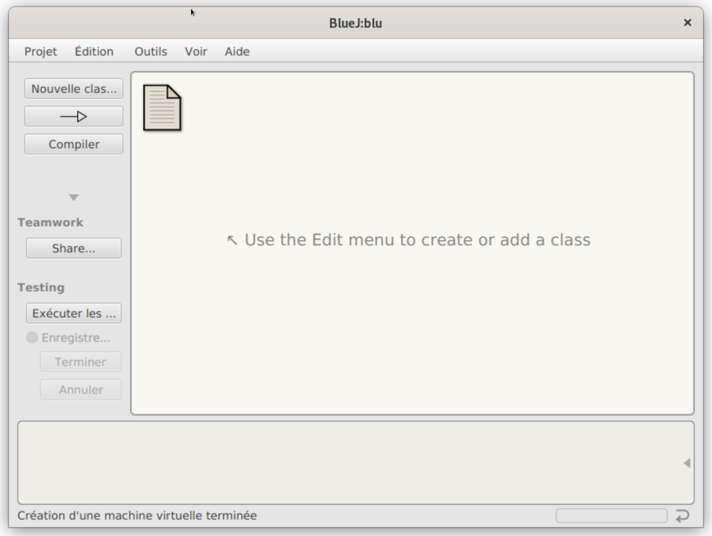
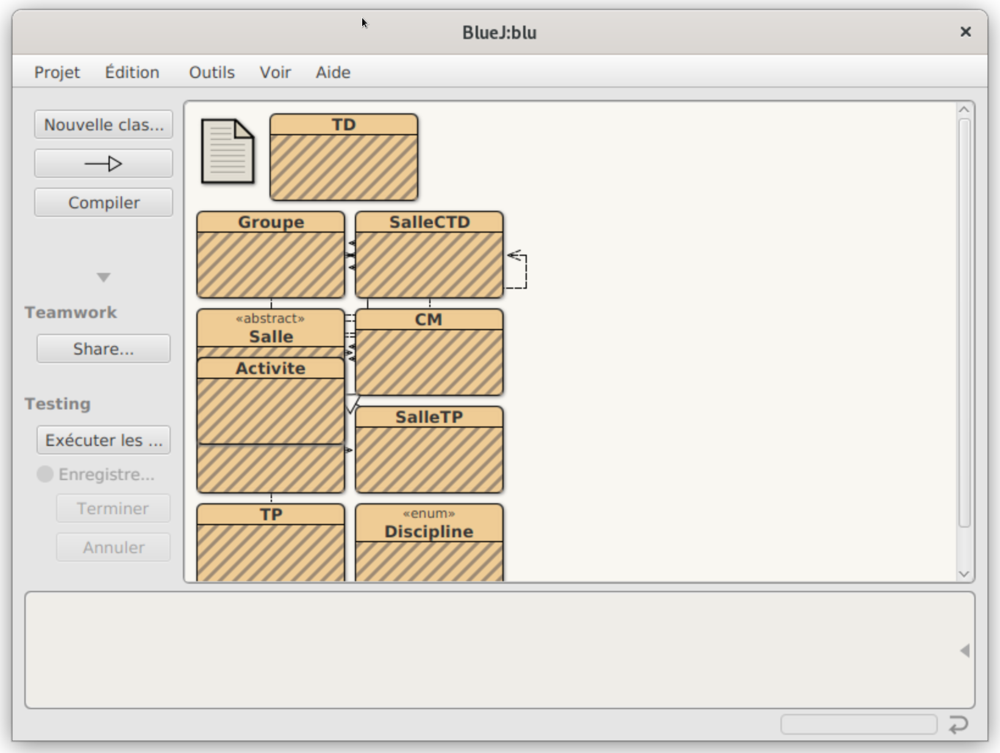
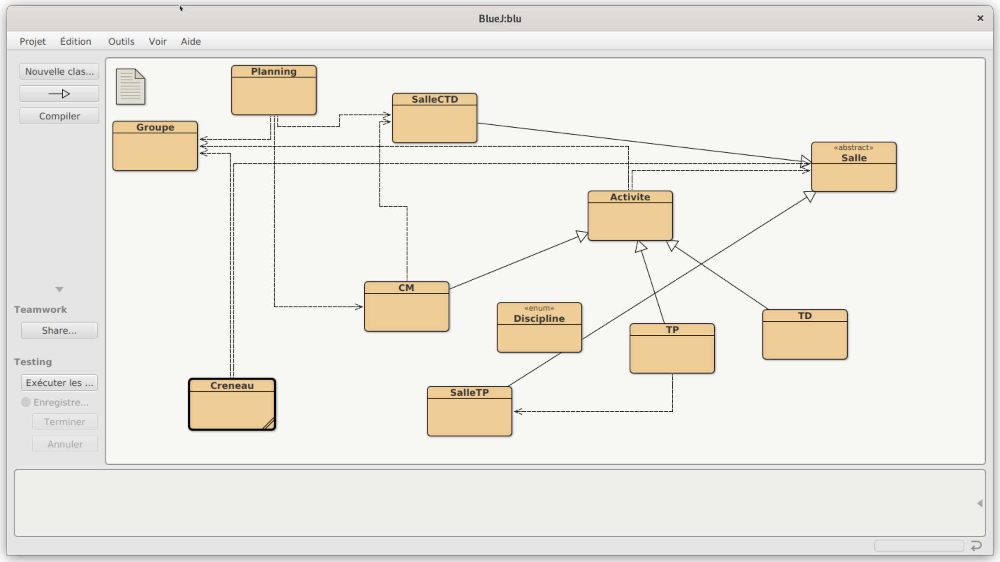
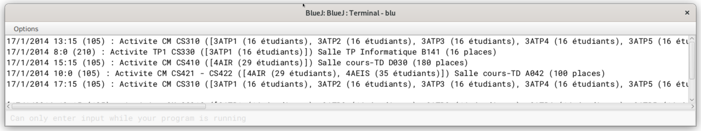

# Quelques éléments pour BlueJ

* apt install bluej sur des machines debian-like

* Attention un "projet BlueJ" n'est pas un projet Eclipse, ni un projet vscode.

# Utilisation

* vous pouvez importer un projet existant 
OU
* créer un nouveau projet : projet, nouveau projet et on sélectionne un répertoire, chez moi le répertoire est vide pour l'instant:

* Ensuite importer, et sélectionner le répertoire TP02, par exemple:

On peut bouger les classes à l'aide de la souris.

* Après clic sur "Compiler" les classes ont perdu leurs hachures.

* et on peut exécuter la classe Planning (la seule qui contient un main) en faisant un clic droit dessus:

