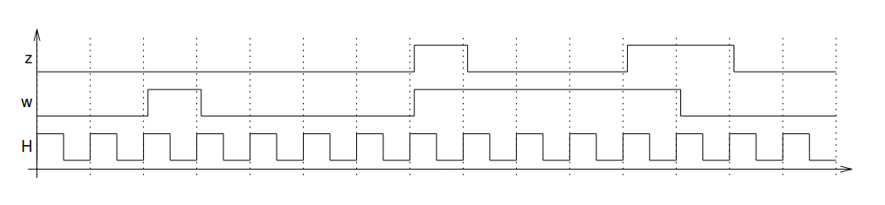

# CS312 TP04

  * Version: 2023/01
  * 2 séances de 1h30
  * Travail à rendre sur Chamilo. Consignes de rendu et deadline: voir Chamilo.

Objectifs de compétences:
* Consolidation: utiliser le mécanisme d'exception ([doc/oracle/java8](https://docs.oracle.com/javase/8/docs/api/java/lang/Exception.html))
[lien wikibook](https://fr.wikibooks.org/wiki/Programmation_Java/Exceptions)
* Nouvelle: comprendre le mécanisme de généricité (V2).
* Consolidation:  implémenter des classes, des méthodes.


## Objectif et histoire de l'application

Nous nous intéressons à la programmation d'automates d'états finis déterministes à entrées et sorties (FSMIO)  définis par:
* un ensemble Q d'états 
* dont l'état initial q0
* un ensemble E d'entrées
* un ensemble S de sorties 
* une fonction de transition t : Q x E -> Q x S : pour chaque état et chaque entrée il existe **un et un seul état successeur** et une et une seule sortie.

Par exemple, considérons dans la suite l'automate A = (Q, q0, E, S, t ) avec:
* Q = {s1, s2, s3}, 
* q0 = s1
* E = {a, b},
* S = {0, 1}, 
* et la fonction de transition `t` définie comme suit : 
  * t(s1, a) = (s1, 0) ; t(s1, b) = (s3, 0)
  * t(s2, a) = (s1, 0) ; t(s2, b) = (s2, 1)
  * t(s3, a) = (s2, 1) ; t(s3, b) = (s3, 1)

qui est aussi graphiquement représenté comme ceci:


Notre objectif est de réaliser une classe Java permettant de
construire de tels automates puis d'effectuer diverses opérations sur
eux en commençant par simuler leur fonctionnement en exécutant des
transitions.

Une première version de la définition des classes de l'application
(éventuellement incomplètes) est donnée dans le répertoire `_code/`


## Startup

Récupérez le répertoire associé à ce TP: 
* soit en faisant un git pull après un clone initial.
* soit en récupérant l'archive associée à ce dépot git à partir de la page web.

Toutes les classes de l'application (éventuellement incomplètes) sont
données dans le répertoire [TP04/_code](_code/). Vous pouvez naviguer dans ce code avec votre navigateur web, ou alors directement dans le répertoire.


## Version 1 de l'application: classe SimpleFSMIO

(répertoire `TP4/_code/V1`)

Afin de réaliser cette classe Java (et les éventuelles autres classes utiles), il est nécessaire de déterminer le type des différents constituants de l'automate que la définition formelle ci-dessus ne précise pas. Dans cette partie, nous allons supposer que:
	* les états de l'automate sont identifiés par leur nom (une chaîne de caractères);
	* les entrées sont des lettres minuscules (de 'a' à 'z');
	* les sorties sont des entiers (int).

Dans le répertoire code nous proposons une classe `FSMIO`, une classe  `SimpleFonctionTransition` fournissant, outre son constructeur, trois méthodes **non implementées**:
   * `SimpleTransitionFunction(String stateNames[], char inputs[])` : constructeur dont les paramètres sont les ensembles d'états et d'entrées de l'automate.
   * `addTransition(String sourceState, char input, String destState, int output)` : permet de définir la fonction de transition.
   * `getOutput(String sourceState, char input)` : retourne la sortie correspondant à la transition ayant comme état d'origine `sourceState` et pour entrée `input`.
* `getNextState(String sourceState, char input)`: retourne l'état destination de cette même transition.

et enfin une classe principale de test:
```java
public static void main(String args[]){
	    String stateNames[] = new String[3];
	    char inputs[] = new char[2];
	    inputs[0] = "s1";
	    stateNames[1] = "s2";
	    stateNames[2] = "s3";
	    inputs[0] = 'a';
	    inputs[1] = 'b';

	    SimpleFSMIO sfsm = new SimpleFSMIO(stateNames, "s1", inputs);
	    sfsm.addTransition("s1", 'a', "s1", 0);
	    sfsm.addTransition("s1", 'b', "s3", 0);
	    sfsm.addTransition("s2", 'a', "s1", 0);
	    sfsm.addTransition("s2", 'b', "s2", 1);
	    sfsm.addTransition ("s3", 'a', "s2", 1);
	    sfsm.addTransition("s3", 'b', "s3", 1);

	    System.out.println(sfsm.getNextState("s1", 'a'));
	    System.out.println(sfsm.getOutput("s3", 'b')); 
}
```
L'appel `sfsm.getNextState("s1", 'a')` retournera la valeur "s1" tandis que l'appel `sfsm.getOutput("s3", 'b')` retournera 1.

* Regarder le contenu existant des classes fournies dans le répertoire `V1` et leur structure.


### Fonction de transition 
On remarque que la fonction de transition n'est pas "construite" par le constructeur de la classe `SimpleFSMIO`: les tables qui permettent de la coder sont en fait uniquement allouées. 


* Compléter les tables ci-dessous pour la fonction de transition de l'automate. Ce sont ces tables qui seront mises à jour via `addTransition`:

(table "prochain état") 
|      | 'a'  | 'b' |
|:----:|:----:|-----|
| "s1" | "s1" |     |
| "s2" |      |     |
| "s3" |      |     |

(table "caractère de sortie")

|      | 'a' | 'b' |
|:----:|:---:|-----|
| "s1" | 0   |     |
| "s2" |     |     |
| "s3" |     |     |


* Compléter la classe `SimpleTransitionFunction`: allocation des tables, initialisation avec des informations vide dans le constructeur, ajout des informations des transitions. Tester.

### Exécution de l'automate.

* Modifier les méthodes `doTransition`, `getNextState` et `getOutput` de la classe `SimpleFSMIO` afin qu'elles vérifient que leurs paramètres sont valides (i.e. que les états et les entrées existent). En cas d'invalidité, ces méthodes doivent déclencher une exception que l'on définira:
```java
	try{
	   <dosomething>
	}
	catch (<replacehere> ex){
```


* Tester la classe `SimpleFSMIO`  en construisant l'automate ci-dessus puis en introduisant la séquence d'entrées "abbaabbaaa" et affichant sur la sortie standard la séquence des sorties correspondantes et le nom des états atteints, comme ceci:
```
s1--(a/0)--s1--(b/0)--s3--(b/1)--s3--(a/1)--s2--(a/0)--s1--(b/0)--s3--(b/1)--s3--(a/1)--s2--(a/0)--s1--(a/0)--s1--END
```
On pourra par exemple utiliser un `CharacterIterator`.


## V2 Avec généricité

(répertoire `TP4/_code/V2`)

On souhaite maintenant réaliser une classe plus générale, permettant de traiter des entrées autres que des caractères et des sorties autres que des entiers, tout en considérant que les états sont toujours identifiés par leur nom (chaîne de caractères). On définit pour cela les interfaces et classes génériques données dans le répertoire `TP4/_code/V2`:
* Dans `FSMIO.java`:
  * les états qui étaient des chaînes deviennent des instances de la classe `State`.
  * les transitions sont maintenant paramétrées:  `TransitionFunction<T1, T2>()`; (type paramétré d'entrée, type de sortie)
* D'autres classes sont fournies. 


* 1) Que valaient T1 et T2  dans la V1 ?  
T1: c'est input donc:char[]  
T2: c'est output donc:int

* 2) Faire un diagramme de classe du code fourni. 
* 3) Pour tester votre compréhension, on demande de compléter la commande `toString` de la classe `TransitionFunction` pour que l'exécution donne:
```
	s1 -> s2 Tag= a/0
	s1 -> s3 Tag= b/0
	s2 -> s3 Tag= a/0
	s2 -> s2 Tag= b/1
	s3 -> s4 Tag= a/0
	s3 -> s3 Tag= b/0
	s4 -> s2 Tag= a/1
	s4 -> s3 Tag= b/1
```
* 4)  Dans le fichier de test, ajouter un automate `FSMIO<int,int>` quelconque.  

* 5) (BONUS) Réaliser un automate (int, int, 0 ou 1 uniquement) qui réalise la fonctionnalité suivante: "on se rappelle des 4 valeurs précédentes des entrées", la sortie courante nommée z:
	* prend la valeur 1 si les quatre transitions précédentes ont "vu" quatre 0 (zéros) de suite ou quatre 1 (uns) de suite.
	* Sinon, la sortie vaut 0.

Autrement dit, l'automate réalise le chronogramme suivant (si on considère qu'on donne en entrée un charactère par tick d'horloge 1 si "en haut", "0" sinon.):




## V3 (à ne pas faire en cas de difficulté)

On fournit dans  `TP4/_code/V3` une classe `FSMIOString` qui permet de lire la description d'un automate de type `FSMIO<String, String>` dans un fichier (un exemple est fourni) et de construire l'objet associé. **info** Cette classe n'a pas été testée intensément cette année, il est possible qu'il y ait quelques modifications à faire.

* Utiliser cette classe pour construire des automates de tests de la version précédente. 

* BONUS Faites des automates qui ont du sens (Une petite recherche sur Internet s'impose pour trouver des automates qui réalisent des choses intéressantes/drôles)

* BONUS ENCORE Utilisez dot/graphviz pour dessiner les automates à partir de Java. [exemple](https://github.com/gboersma/jdot)
